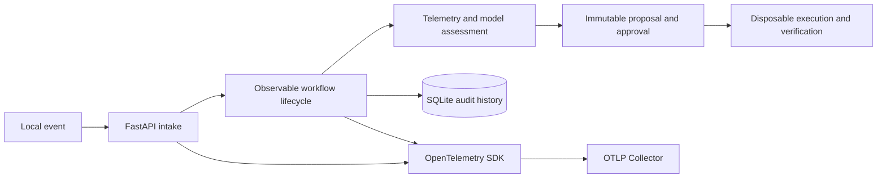

# incident-response-agent

[](https://github.com/cameronqj/incident-response-agent/actions/workflows/test.yml)

`incident-response-agent` is an observability-focused POC that uses a bounded incident-remediation workflow as its demonstration workload. It shows how traces, metrics, structured audit events, correlation IDs, model telemetry, and security-conscious redaction follow one request from intake through assessment, approval, execution, and verification.

The goal is to demonstrate observable application behavior across a realistic multi-stage workflow, not to provide a production incident-response product.

## What it demonstrates

- Correlated FastAPI and workflow spans across intake, telemetry collection, model analysis, proposal creation, approval, execution, and expiration.
- Bounded metrics for event-to-proposal latency, model latency/tokens/retries, approval wait, execution outcomes, and expirations.
- A durable SQLite audit trail for sanitized state transitions, model observations, decisions, retries, failures, execution results, and actor labels.
- OTLP/HTTP export to a real disposable OpenTelemetry Collector, with strict attribute allowlists and secret-leakage regression tests.
- Deterministic offline instrumentation tests plus separately labeled container and live-inference evidence.
- A realistic workflow workload: synthetic disk, CPU, memory, restart-loop, and log-storm scenarios; bounded ENOSPC/OOM checks; and one real unhealthy disposable-service recovery cycle.

## Signal coverage

| Signal | Implemented evidence | Deliberate boundary |
| --- | --- | --- |
| Traces | FastAPI server spans, parented lifecycle spans, tool/executor spans, errors, normalized routes | No production sampling or trace backend |
| Metrics | Latency histograms, model token/retry counts, approval wait, execution outcomes, expirations, standard HTTP metrics | Bounded attributes; no dashboards or alert rules |
| Structured audit events | Trace-correlated SQLite history for workflow state, decisions, failures, actors, and results | Durable POC audit store, not a general log platform |
| Logs | Bounded event log lines are normalized, sanitized, and available as workflow evidence | No OpenTelemetry Logs pipeline or centralized log backend is claimed |

## Architecture



The incident workflow provides enough branching, latency, failure, approval, and side-effect behavior to make telemetry meaningful. SQLite records the sanitized durable history; OpenTelemetry supplies operational traces and metrics. Both are correlated without exporting event bodies, prompts, evidence text, credentials, paths, or arbitrary model output.

## Scope boundary

This is not production incident response or a production observability platform. It does not inspect or remediate host or production processes and services, authenticate production webhooks, provide production identity or RBAC, execute model-generated commands, offer autonomous remediation, export OpenTelemetry logs, or configure a production telemetry backend. Marker removal tests workflow, policy, approval, persistence, audit, and instrumentation behavior; only the explicitly enabled container-service lab performs a real restart, and only against the service it created and owns.

## OpenTelemetry export

OpenTelemetry traces and metrics are disabled by default. SQLite audit history remains the durable source of truth. To export OTLP/HTTP to a local collector:

```bash
OTEL_ENABLED=1 \
OTEL_EXPORTER_OTLP_ENDPOINT=http://127.0.0.1:4318 \
OTEL_SERVICE_NAME=incident-response-agent \
  .venv/bin/python -m incident_response_agent.cli serve
```

Manual spans cover event intake, telemetry collection, model analysis, proposal creation and decision, remediation execution/tool invocation, and expiration. Metrics cover event-to-proposal time, model latency/tokens/retries, approval wait, execution outcomes, and expirations. FastAPI request spans and standard HTTP metrics are also enabled.

Exporter attributes are deliberately narrow: generated workflow IDs, proposal revision, scenario/kind, allowlisted action ID, decision, result, reason code, counts, and durations. Authorization headers, event bodies, prompts, evidence or model text, log lines, paths, API keys, tokens, and arbitrary model output are not exported. An HTTP exporter may target loopback only; remote collectors require HTTPS. This POC does not configure a production collector, authentication, sampling policy, dashboards, alerts, telemetry retention, or an OpenTelemetry Logs pipeline.

The collector integration test uses a digest-pinned disposable OpenTelemetry Collector and remains opt-in with the other container evidence:

```bash
RUN_CONTAINER_TESTS=1 .venv/bin/python -m pytest tests/test_otel_collector_integration.py
```

## Quickstart

Use a project virtual environment for every Python command:

```bash
./scripts/bootstrap.sh
.venv/bin/python -m incident_response_agent.cli demo
```

The bootstrap script creates `.venv`, installs only into that environment, creates or migrates `.data/incident-response.sqlite3`, and runs the offline suite. It does not create, copy, print, or modify `.env`. `SQLiteStore` also initializes and migrates the schema on normal startup, so no separate migration service is required for this POC. To initialize a different path without starting the API:

```bash
.venv/bin/python -m incident_response_agent.cli init-db --database-path .data/incident-response.sqlite3
```

The CLI demo uses a process-owned temporary sandbox and deterministic fake model. It does not require a bearer token, container engine, network, or API key.

For a real disposable-service recovery cycle, use a bearer token and a working Podman/Docker engine. The command displays the immutable proposal and waits for `approve` before restarting anything:

```bash
export INCIDENT_AGENT_BEARER_TOKEN='replace-with-a-local-random-token'
APP_MODE=demo EXECUTION_ENGINE=container \
  .venv/bin/python -m incident_response_agent.cli container-service-demo
```

Set `APP_MODE=live` to use the configured generic inference adapter in the same cycle. Live mode requires its API-key environment variable and never falls back to demo inference.

Run the offline suite:

```bash
.venv/bin/python -m pytest -m 'not integration and not live'
```

## Local API access

The HTTP API binds to `127.0.0.1` by default. All mutating endpoints require one environment-configured POC bearer token. With no token, mutations are disabled; loopback `GET /runs/{run_id}` inspection remains available. Non-loopback binding requires authentication for every endpoint.

```bash
export INCIDENT_AGENT_BEARER_TOKEN='replace-with-a-local-random-token'
HOST=127.0.0.1 EXECUTION_ENABLED=0 APP_MODE=demo \
  .venv/bin/python -m incident_response_agent.cli serve
```

Example local simulation:

```bash
curl -X POST http://127.0.0.1:8000/events \
  -H "Authorization: Bearer ${INCIDENT_AGENT_BEARER_TOKEN}" \
  -H 'Content-Type: application/json' \
  -d '{"idempotency_key":"demo-001","source":"local_simulation","observed_at":"2026-07-19T12:00:00Z","payload":{"scenario":"disk-exhaustion","summary":"synthetic fixture","log_lines":[],"context":[]}}'
```

This single bearer token is POC-level access control only. It provides no users, roles, identity federation, or separation between approval and execution authority. Tokens are accepted only through the `Authorization` header.

Remediation execution is disabled by default. Enabling it requires the bearer token and a Podman/Docker executor:

```bash
EXECUTION_ENABLED=1 EXECUTION_ENGINE=container \
  .venv/bin/python -m incident_response_agent.cli serve
```

The HTTP service never enables the filesystem executor. Runtime execution creates its own disposable sandbox and uses a digest-pinned, non-root, network-isolated, read-only container with CPU, memory, PID, temporary-filesystem, and timeout bounds.

To run the real service scenario through the same local HTTP endpoints, explicitly select the lab mode:

```bash
INCIDENT_AGENT_BEARER_TOKEN='replace-with-a-local-random-token' \
EXECUTION_ENABLED=1 LAB_MODE=container-service APP_MODE=demo \
  .venv/bin/python -m incident_response_agent.cli serve
```

In this mode the service creates one target container internally, waits for its bounded health check to report `unhealthy`, and accepts only the `restarting-service` scenario. Event intake, inference, proposal revision, approval, expiration, execution claim, and audit use the existing API and SQLite workflow. Neither the request nor the model can provide the target, image, mount, path, or command.

## Container failure lab

Initialize Podman once if needed, then run the integration suite:

```bash
podman machine init --rootful podman-machine-default
podman machine start podman-machine-default
RUN_CONTAINER_TESTS=1 .venv/bin/python -m pytest -m 'integration and not live'
```

Docker is used automatically when Podman is unavailable. The pinned multi-architecture image may be fetched by digest when absent. ENOSPC and OOM tests are genuine bounded `container_fault` checks but remain separate from the agent flow. The container-service integration is also `container_fault` evidence: a real service returns HTTP 503, becomes OCI-unhealthy, is restarted after approval, and becomes healthy. The other agent scenarios remain `synthetic_marker` fixtures.

## Generic live inference

The optional live test exercises the configured OpenAI-compatible chat-completions contract. It is not an OpenCode integration or general provider-compatibility claim.

```bash
RUN_LIVE_TESTS=1 .venv/bin/python -m pytest -m live
```

Defaults are base URL `https://opencode.ai/zen/go/v1`, model `deepseek-v4-flash`, and API-key environment variable `OPENCODE_KEY`. They remain configurable through `MODEL_BASE_URL`, `MODEL_NAME`, and `MODEL_API_KEY_ENV`. Live mode fails clearly when its key is absent and never falls back to fake inference.

Live provider responses are read through a 65,536-byte hard limit before parsing. Structured assessment summaries are limited to 2,000 characters, `evidence_refs` to 20 items of at most 500 characters each, and unknown fields are rejected.

The combined real-model/real-service cycle is separately opt-in:

```bash
RUN_CONTAINER_TESTS=1 RUN_LIVE_TESTS=1 .venv/bin/python -m pytest -m live
```

## Evidence level

Offline tests provide deterministic evidence for schemas, authentication, sanitization, idempotency, approval gates, atomic claims, expiration, scenario/action-kind compatibility, sandbox validation, persistence, audit behavior, and in-memory OpenTelemetry export. Container tests provide separately labeled evidence for bounded faults, one real disposable-service restart, and OTLP delivery to a disposable collector. Live model behavior is variable integration evidence, not deterministic test evidence. See `docs/evidence.md` and `SECURITY.md`.
