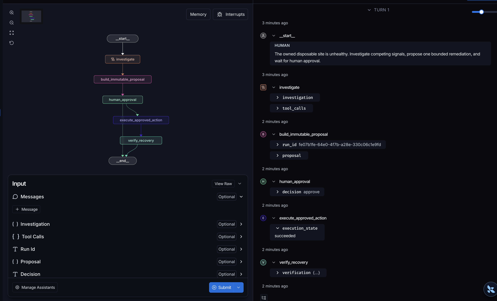
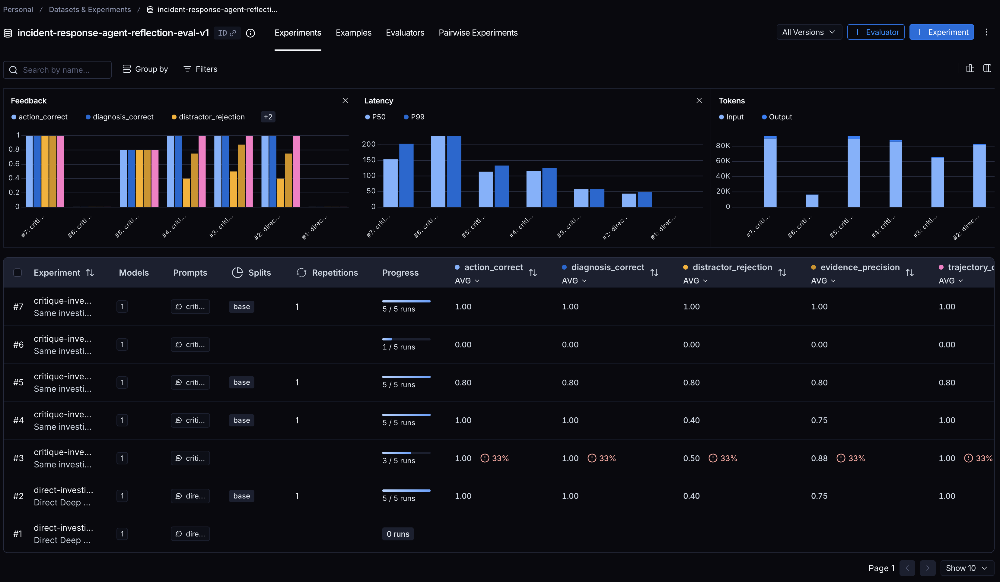

# Verification evidence

Evidence is retained as dated snapshots. Later feature verification supplements rather than replaces earlier results.

## 2026-07-19 baseline

- Scope: bounded local POC
- Python: 3.12 project virtual environment

### Reproducible checks

| Evidence | Command | Result | Scenario kind |
| --- | --- | --- | --- |
| Bootstrap, schema initialization, and offline suite | `./scripts/bootstrap.sh` | schema version 2; 114 passed | `synthetic_marker` plus container-policy simulation |
| Offline workflow, security, persistence, concurrency, and in-memory OTel export | `.venv/bin/python -m pytest -m 'not integration and not live'` | 114 passed | `synthetic_marker` plus container-policy simulation |
| Podman/Docker failure lab, remediation, and disposable OTLP collector | `RUN_CONTAINER_TESTS=1 .venv/bin/python -m pytest -m 'integration and not live'` | 13 passed | `container_fault` and `synthetic_marker` |
| Generic inference plus real service recovery | `RUN_CONTAINER_TESTS=1 RUN_LIVE_TESTS=1 .venv/bin/python -m pytest -m live` | 2 passed | live integration |

The ENOSPC and OOM failure-lab checks are genuine bounded container faults, but they remain separate from the agent workflow. CPU, memory, disk-remediation, log-storm, and the original restarting-service agent scenarios use synthetic evidence or marker files. The new service lab is a real bounded agent cycle: the owned HTTP service returns 503 and reports OCI `unhealthy`; no restart occurs before exact approval; execution restarts the same container ID; its second boot returns 200 and reports `healthy`; cleanup verifies removal.

The OpenTelemetry checks verify manual lifecycle spans, FastAPI server-span parenting, bounded metrics, exception-message suppression, normalized HTTP routes, and absence of bearer/API-key/path/private-IP/query/user-agent/host canaries from in-memory exports. The container test then sends traces and metrics to a digest-pinned, non-root, read-only disposable OpenTelemetry Collector and verifies receipt and cleanup. This is local export-path evidence, not evidence for a production backend, authentication, retention, dashboards, alerts, or sampling policy.

Persistence regression tests query SQLite directly and verify JSON-shaped credential values are absent after normalization. Model-boundary tests verify the provider body is capped before parsing and each `evidence_refs` item is independently length-limited.

### Live-inference observation

- Endpoint label: `configured-openai-compatible-chat-completions`
- Configured endpoint: `https://opencode.ai/zen/go/v1`
- Model: `deepseek-v4-flash`
- Real external model: yes
- Disk workflow: 5,558 ms, 1,019 tokens, 0 retries
- Real disposable-service workflow: 4,817 ms, 1,000 tokens, 0 retries
- Observed variability: an earlier historical run failed after three bounded attempts returned empty content; both current verification paths passed without retry.

This proves configured OpenAI-compatible assessment in both the disk flow and a real disposable-service restart flow. It does not prove provider reliability, general compatibility, deterministic model behavior, production webhook handling, real-host detection, arbitrary-container safety, or production remediation safety.

## 2026-08-10 Deep Agents extension

- Scope: hidden-fault `site-unhealthy` investigation plus full regression
- Python: 3.12 project virtual environment
- Deep Agents: 0.7.5

### Reproducible checks

| Evidence | Command | Result | Scenario kind |
| --- | --- | --- | --- |
| Targeted offline Deep Agents trajectory, policy, permissions, audit, recovery, and OTel checks | `.venv/bin/python -m pytest tests/test_site_investigation.py -m 'not integration and not live'` | 6 passed | `synthetic_marker` |
| Full offline regression | `.venv/bin/python -m pytest -m 'not integration and not live'` | 120 passed; 17 deselected | `synthetic_marker` plus container-policy simulation |
| Targeted approved Deep Agent cleanup through the hardened container executor | `RUN_CONTAINER_TESTS=1 .venv/bin/python -m pytest tests/test_site_investigation.py -m integration` | 1 passed | `synthetic_marker` with containerized execution |
| Full container regression | `RUN_CONTAINER_TESTS=1 .venv/bin/python -m pytest -m 'integration and not live'` | 14 passed; 123 deselected | `container_fault` and `synthetic_marker` |
| Targeted live Deep Agents tool-calling investigation | `RUN_LIVE_TESTS=1 .venv/bin/python -m pytest tests/test_site_investigation.py -m live` | 1 passed | live inference over `synthetic_marker` evidence |
| Full live regression | `RUN_CONTAINER_TESTS=1 RUN_LIVE_TESTS=1 .venv/bin/python -m pytest -m live` | 3 passed; 134 deselected | live integration |

The offline checks use a scripted tool-calling chat model through the real `create_deep_agent` harness. They verify bounded diagnostic tools, absence of the hidden scenario in observations, observed-evidence citation enforcement, deterministic action compatibility, no shell exposure, handoff to hash-bound approval, recovery verification, and content-free OTel attributes. This proves harness integration and deterministic trajectory behavior, not live-model reliability or real-host diagnosis.

The container-marked check runs the approved cleanup through the existing hardened container executor and verifies recovery. A native `qwen3.6-plus` probe confirmed that thinking mode also rejects forced tool choice at this endpoint; using Qwen's non-thinking request setting accepts Deep Agents' normal structured tool choice without a custom binding adapter. The state backend and permissions still deny filesystem access and expose no shell. The fixture provides one clear chain—disk pressure followed by failed rotation—so a useful investigation can stop after a small evidence set.

### Live-inference observation

- Endpoint label: `configured-openai-compatible-deep-agent`
- Configured endpoint: `https://opencode.ai/zen/go/v1`
- Model: `qwen3.6-plus`
- Real external model: yes
- Result: diagnosed `disk-exhaustion` and selected `cleanup_rotated_logs`
- Provider configuration: `enable_thinking=false`; retain Deep Agents' native tool binding
- Observed variability: Qwen thinking mode rejected required tool choice; non-thinking mode completed with `check_site_health`, `inspect_recent_logs`, and `inspect_resources` and returned the expected diagnosis.

The captured Studio view below shows the compiled baseline Deep Agents graph and a successful live Qwen trace, including the `check_site_health`, `inspect_resources`, and `inspect_recent_logs` calls and their bounded evidence. Studio visualizes the investigation and structured handoff; approval, execution, and recovery remain in the application control plane and are verified separately above. The image is presentation evidence, not a substitute for the reproducible tests or deterministic result validation. The capture excludes account details and persistent thread identifiers.

This proves one successful live Deep Agents investigation against the configured endpoint and the complete existing live regression. It does not prove deterministic diagnosis, general provider compatibility, safe arbitrary shell access, production-host inspection, or autonomous remediation.

## 2026-08-11 multi-signal investigation supplement

The second profile preserves the hidden disk-exhaustion ground truth and existing `cleanup_rotated_logs` action while adding elevated CPU and a recent successful deployment as distractors.

| Evidence | Command | Result | Scenario kind |
| --- | --- | --- | --- |
| Targeted offline Deep Agents baseline, multi-signal, and human-interrupt checks | `.venv/bin/python -m pytest tests/test_site_investigation.py -m 'not integration and not live'` | 11 passed; 3 deselected | `synthetic_marker` |
| Full offline regression | `.venv/bin/python -m pytest -m 'not integration and not live'` | 125 passed; 18 deselected | `synthetic_marker` plus container-policy simulation |
| Targeted live baseline and multi-signal investigations | `RUN_LIVE_TESTS=1 .venv/bin/python -m pytest tests/test_site_investigation.py -m live` | 2 passed; 10 deselected | live inference over `synthetic_marker` evidence |

The deterministic tests verify that the resource, recent-change, and log observations were gathered, execution failed before approval, and the sandbox remained unhealthy. The full Studio graph then pauses with a JSON-serializable approval payload; tampered hashes are rejected, while exact hash-bound approval enables only the existing cleanup and post-execution health returns HTTP 200. A traced local run completed `investigate → build_immutable_proposal → human_approval → execute_approved_action → verify_recovery` with the final health status 200. The live Qwen check completed the same three-source investigation and returned `disk-exhaustion` with `cleanup_rotated_logs`. This is one controlled multi-signal and human-interrupt demonstration, not general causal-reasoning evidence, restart durability, or a production incident simulation.

The Studio capture below complements the baseline tool-trace image above. It shows the parent workflow after resume: the immutable proposal stage, recorded human `approve` decision, successful bounded execution, and recovery-verification node. The visible run ID is generated workflow metadata; the capture excludes account details, credentials, local paths, and persistent thread identifiers.

## 2026-08-11 LangSmith reflection evaluation

The discrete `reflection-eval` harness used the versioned `incident-response-agent-reflection-eval-v1` dataset (ID `92d8421f-7ca3-4b71-a72a-4c7c65211aa3`) with five synthetic hidden-ground-truth cases and one repetition per target. The generic alert and diagnostic observations contain no expected scenario, action, or causal/distractor labels.

| Experiment | ID | Completed cases | Diagnosis | Action | Evidence precision | Distractor rejection | Tool coverage | Within budget |
| --- | --- | ---: | ---: | ---: | ---: | ---: | ---: | ---: |
| Direct baseline `direct-investigator-v1-2f0cd939` | `9f594c90-5637-461f-b786-2424ed31be15` | 5/5 | 1.00 | 1.00 | 0.75 | 0.40 | 1.00 | 1.00 |
| First critique `critique-investigator-v1-0dade9fd` | `4a530137-5a52-47c3-8e01-4ae4b9b42f5f` | 5/5 | 1.00 | 1.00 | 0.75 | 0.40 | 1.00 | 1.00 |
| Refined critique `critique-investigator-v4-579fb91c` | `54d77e7d-0fb4-4887-bb45-f28e169eedd9` | 5/5 | 1.00 | 1.00 | 1.00 | 1.00 | 1.00 | 1.00 |

The LangSmith capture below shows the versioned dataset's experiment table, deterministic feedback columns, completion counts, latency, and token usage. It intentionally includes the incomplete and failed iterations alongside the direct baseline and successful refined experiment. This evaluation mode is not exported as a separate Studio graph: LangSmith invokes the direct and reflective targets as dataset experiments and records their underlying Deep Agent traces per example.

The first critique produced no measurable change. Inspection showed that its rubric accepted observations used only to rule out alternatives. The refined version requests a per-citation causal classification and derives the revision decision in code. A partial v2 run scored four cases successfully but failed one incomplete structured classification; a later attempt exposed provider calls exceeding the normal 30-second interactive timeout. The final v4 experiment conservatively retains missing classifications and uses an evaluation-only 120-second request timeout. It completed in approximately 14 minutes.

In this one-run comparison, the reflective configuration scored 0.25 higher on evidence precision and 0.60 higher on distractor rejection without a difference in diagnosis, action, trajectory coverage, or tool-budget scores. Because the direct and reflective targets are separate stochastic investigations and v4 did not retain its pre-critique citations, this result does not isolate the critique as the cause of the difference. Subsequent runs record initial and final citations plus whether revision was applied for same-run inspection. This is not evidence of statistical significance, an official AIOps benchmark, production incident performance, autonomous prompt improvement, or lower latency/cost. Reproduce with `.venv/bin/python -m incident_response_agent.cli reflection-eval --mode both --repetitions 1`; live model output and duration may vary.

## 2026-08-11 governed runbook-learning POC

This discrete knowledge-promotion path uses application-owned review methods and SQLite rather than Studio approval. Tests simulate a human actor through the same `review` and `revise` methods a future trusted CLI or API would call. Promotion changes only the approved runbook registry; it does not add an executable action or modify the remediation whitelist.

| Evidence | Command | Result | Scenario kind |
| --- | --- | --- | --- |
| Targeted offline research, review, evaluation, persistence, reuse, and tamper checks | `.venv/bin/python -m pytest tests/test_runbook_learning.py` | 9 passed | `synthetic_marker` |
| Full offline regression | `.venv/bin/python -m pytest -m 'not integration and not live'` | 141 passed; 18 deselected | `synthetic_marker` plus container-policy simulation |
| Live runbook research with direct simulated approval | `.venv/bin/python -m incident_response_agent.cli runbook-learning-demo --database-path .data/runbook-learning-evidence.sqlite3 --simulate-review approve` | candidate retained as `evaluation_failed`; 0.60 case accuracy | live inference over `synthetic_marker` evidence |
| Live research, simulated reviewer revision, promotion, and later retrieval | `.venv/bin/python -m incident_response_agent.cli runbook-learning-demo --database-path .data/runbook-learning-evidence.sqlite3 --simulate-review revise-approve` | revision passed 5/5 cases, promoted version 1, then retrieved | live inference over `synthetic_marker` evidence |

The live `qwen3.6-plus` researcher inspected health, resources, recent changes, and bounded logs without receiving the private problem signature. Its first candidate correctly connected increased worker concurrency, 96 percent memory pressure, and correlated OOM kills, but made generic HTTP 503 and worker-unavailable symptoms mandatory applicability signals. Simulated approval did not override the gate: two positive cases failed to match. A second live candidate showed the same overly strict shape; the simulated reviewer preserved it as `superseded`, created a digest-bound revision containing only the causal applicability signals and evidence categories, and approved that revision for evaluation. The revision matched both positive cases, rejected all three distractors, was promoted as version 1, and was returned for a later incident with the same causal signals.

This demonstrates one human-governed knowledge-learning loop: research, immutable proposal, review edit, hidden evaluation, versioned promotion, persistence, and reuse. The reviewer is simulated, the cases are small and synthetic, and the later incident reuses the same fixture signals. It does not demonstrate autonomous learning, production telemetry access, general runbook quality, executable capability promotion, or safe production remediation.

## 2026-08-11 promoted-runbook application experiment

The final runbook phase used the versioned `incident-response-agent-runbook-application-v1` LangSmith dataset and two fresh Deep Agent investigations over the same unfamiliar worker-memory incident. The baseline registry was empty. Between runs, a separately invoked live researcher proposed a candidate, the simulated application reviewer created a linked revision, and the deterministic five-case gate promoted version 1. The second agent could access the promoted registry only through the read-only `search_approved_runbooks` and `open_approved_runbook` tools.

| Reproducible check | Command | Result |
| --- | --- | --- |
| Targeted application, full orchestration, citation, visibility, tamper, evaluator, and LangSmith-usage checks | `.venv/bin/python -m pytest tests/test_runbook_application_eval.py` | 8 passed |
| Full offline regression | `.venv/bin/python -m pytest -m 'not integration and not live'` | 149 passed; 18 deselected |

| Experiment | ID | Diagnosis | Required evidence | Distractor avoidance | Tool trajectory | Latency | Tokens | Exact runbook citation |
| --- | --- | ---: | ---: | ---: | --- | ---: | ---: | ---: |
| Before `runbook-before-learning-v1-d8b12276` | `150539c8-170b-452c-acb7-33f9980a97eb` | 1.00 | 1.00 | 0.00 | 4 diagnostic calls + search | 10,474 ms | 7,013 | 0.00 |
| After `runbook-after-learning-v1-2bcf82f4` | `b337072c-0dfa-4549-b72d-c3d1286a8023` | 1.00 | 1.00 | 0.00 | 4 diagnostic calls + search + open | 12,692 ms | 10,837 | 1.00 |

The later agent found, opened, and exactly cited `worker-oom-under-high-concurrency` version 1 with content digest `6f1c761692ff46037202546690fdee80539b089ab11197f84c5cddf140d220ec`. Its diagnosis remained correct and retained all required evidence. It also retained the generic health observation, so distractor avoidance did not improve and this run does not establish that retrieval improved or changed its evidence selection. The explicit citation improved from 0 to 1 at the cost of one additional tool call, 2,218 ms, and 3,824 tokens in this single stochastic comparison.

The offline visibility regression verifies that pending, rejected, superseded, and evaluation-failed candidates return no match; only the promoted immutable version is searchable; and direct or search-based access to a digest-tampered promoted record fails closed. A forged citation is also rejected unless the exact version was returned by search and opened in the same investigation thread.

One earlier after-learning attempt retrieved and opened the correct version but the provider encoded a nested structured-output citation as a JSON string. Deep Agents retried the invalid output until its recursion limit. The provider-facing schema now uses three flat citation fields and reconstructs the typed citation at the application boundary; the regression suite covers that contract. This evidence demonstrates reviewed knowledge affecting a later Deep Agent trajectory, not statistically significant quality improvement, production incident learning, or executable authority.

## 2026-08-12 governed capability-learning POC

This discrete capability path is the roadmap's follow-on slice: a Deep Agent proposes a typed capability contract for one owned disposable worker, an application-owned reviewer and deterministic hidden-case gate promote it, and a later incident activates it through the existing immutable proposal and hash-bound approval with verification and rollback. Promotion changes only the capability registry and grants no execution authority; the capability and runbook registries remain separate.

| Evidence | Command | Result | Scenario kind |
| --- | --- | --- | --- |
| Targeted capability research, policy, review, promotion, retrieval, separation, executor, activation, rollback, and orchestration checks | `.venv/bin/python -m pytest tests/test_capability_learning.py` | 22 passed | `synthetic_marker` |
| Full offline regression | `.venv/bin/python -m pytest -m 'not integration and not live'` | 184 passed; 18 deselected | `synthetic_marker` plus container-policy simulation |

The deterministic checks verify that the research agent sees only observed evidence and never the hidden expected capability id; that only application review decisions with a passing gate promote; that approval alone cannot bypass a failing gate; that revisions supersede the original and pass the same gate; that rejected, superseded, evaluation-failed, and digest-tampered candidates are never retrievable; that promoted capabilities are invisible to the runbook registry and vice versa; that the executor rejects any action, target, or parameter outside the approved bounds; that repeated activation at or below the target is an idempotent no-op; and that a forced verification failure rolls back the previous concurrency and is auditable. The full orchestration test runs research → review revision → promotion → later incident → activation → failed verification → rollback with scripted models, matching the demo path without live inference or LangSmith retention.

The live `capability-learning-demo` reuses the configured Deep Agents endpoint and an explicitly simulated reviewer; it requires `OPENCODE_KEY` exactly like the other live demos and never falls back to demo inference. This demonstrates one governed executable-capability lifecycle with one-target activation and rollback, not fleet-wide capability activation, production safety, containerized worker execution, or SREGym-style cluster evaluation.

### Live-inference observation (2026-08-12)

- Endpoint label: `configured-openai-compatible-deep-agent`
- Configured endpoint: `https://opencode.ai/zen/go/v1`
- Model: `qwen3.6-plus`
- Real external model: yes
- Promotion: `.venv/bin/python -m incident_response_agent.cli capability-learning-demo --database-path .data/capability-live.sqlite3 --simulate-review revise-approve` — the live researcher's first proposal cited a prerequisite signal that no diagnostic returned; the application rejected it as a contract violation. The model proposal violated the observed-evidence contract, so the POC stripped the unobserved signals from the model's own proposal (or substituted an application-owned reference contract when salvage was impossible) and passed that contract through revision and promotion; `reduce_worker_concurrency` version 1 was promoted. Activation of a later incident proposal carried the promoted capability binding (id, version, digest) and concrete application-chosen parameters `target_concurrency=4`; execution revalidated the binding against the registry and succeeded; health returned HTTP 200 and final concurrency was 4.
- Rollback: `--fail-verification` on the same flow forced the post-activation health check to fail; the run ended `failed`, the executor restored concurrency 12, and the activation record reported `rollback_applied=true`.

The live researcher's unobserved-prerequisite failure is the same over-generalization the runbook evidence documented; the governed reviewer path absorbed it without weakening the observed-evidence contract. This is one controlled live demonstration, not general capability-proposal quality, production capability activation, or statistical significance.

## 2026-08-12 capability-application experiment

The final capability phase used the `incident-response-agent-capability-application-v1` dataset shape and two fresh Deep Agent investigations over the same unfamiliar worker-memory incident. The baseline registry was empty. Between runs, a live researcher proposed a candidate (again violating the observed-evidence contract; the simulated reviewer corrected it), the deterministic five-case gate promoted `reduce_worker_concurrency` version 1, and the second agent could access the promoted registry only through the read-only `search_approved_capabilities` and `open_approved_capability` tools. Reproduced without LangSmith retention (`--no-upload`); the same local case and evaluators are used in both modes.

| Reproducible check | Command | Result |
| --- | --- | --- |
| Targeted application, orchestration, citation, mismatch, evaluator, and fallback checks | `.venv/bin/python -m pytest tests/test_capability_application_eval.py` | 8 passed |
| Full offline regression | `.venv/bin/python -m pytest -m 'not integration and not live'` | 194 passed; 18 deselected |
| Live before/after with scripted review | `.venv/bin/python -m incident_response_agent.cli capability-application-eval --no-upload` | before and after both completed |

| Experiment | Diagnosis | Required evidence | Distractor avoidance | Tool coverage | Capability correct | Exact capability citation | Latency |
| --- | ---: | ---: | ---: | ---: | ---: | ---: | ---: |
| Before (empty registry) | 1.00 | 1.00 | 0.00 | 1.00 | 0.00 | 0.00 | 11,060 ms |
| After (promoted capability) | 1.00 | 1.00 | 0.00 | 1.00 | 1.00 | 1.00 | 13,008 ms |

The later agent searched, opened, and exactly cited `reduce_worker_concurrency` version 1 with content digest `d3a78ad553c4472e75292c107acff8ad8e939a553319cfba9115c004917714ed`, and its proposed capability became correct (0 → 1). Its diagnosis, required evidence, and tool coverage were already correct and stayed correct; it retained the generic health observation, so distractor avoidance did not improve and this run does not establish that retrieval improved its evidence selection. The explicit citation improved from 0 to 1 at the cost of one additional tool call and roughly two seconds of latency. The before run's wrong proposed capability and the after run's exact citation are the observable difference the governed capability loop is designed to produce; this is one stochastic live comparison, not statistical significance. The offline visibility regression verifies that unpromoted states are never searchable and that a citation must match a capability actually opened in the same investigation thread.

## 2026-08-12 evidence-scope steering supplement

Both application evals previously showed flat distractor avoidance: the after-learning agent opened the promoted knowledge but still cited the generic `health-1` observation. The opened-knowledge tools now return an explicit `evidence_scope` contract — cite only observations whose category is in the promoted `required_evidence_categories`; other categories (such as a generic health status) are symptoms, not causal evidence — and both system prompts reinforce the same rule when a promoted record is opened. Re-running both live evals with that steering:

| Experiment | Distractor avoidance before | Distractor avoidance after | Delta | After evidence_refs | Latency before/after |
| --- | ---: | ---: | ---: | --- | ---: |
| Capability (`capability-application-eval --no-upload`) | 0.00 | 1.00 | +1.00 | `resources-1`, `changes-1`, `logs-1` | 11,034 / 12,176 ms |
| Runbook (`runbook-application-eval --no-upload`) | 0.00 | 1.00 | +1.00 | `resources-1`, `changes-1`, `logs-1` | 9,966 / 12,014 ms |

In both after runs the agent cited exactly the promoted contract's required evidence categories and dropped the generic health observation; the before runs kept the same `health-1`, `resources-1`, `changes-1`, `logs-1` shape as the earlier flat runs. The capability after run also retained the correct proposed capability and exact citation; the runbook after run retained the exact runbook citation. This is the first measured evidence that retrieval changed evidence selection, not only the action or citation choice. The added `evidence_scope` field and prompt reinforcement are the only mechanism changes; each comparison is one stochastic live run, not statistical significance, and the cost is the extra open call plus roughly one to two seconds of latency.

| Reproducible check | Command | Result |
| --- | --- | --- |
| Steering directive presence, orchestration, citation, mismatch, evaluator, and fallback checks | `.venv/bin/python -m pytest tests/test_capability_application_eval.py tests/test_runbook_application_eval.py` | 17 passed |
| Full offline regression | `.venv/bin/python -m pytest -m 'not integration and not live'` | 196 passed; 18 deselected |

### Steering stability across three additional live runs each (2026-08-12)

The steering supplement above was a single live comparison per loop. To test stability, both evals were re-run three more times each with fresh in-memory registries and the same model, always `--no-upload`:

| Loop | Run | Violation | After: Dx | After: evidence | After: distractor | After: coverage | After: capability/runbook | After: citation |
| --- | --- | --- | ---: | ---: | ---: | ---: | ---: | ---: |
| Capability | 1 | yes | 1.00 | 1.00 | 1.00 | 1.00 | 1.00 | 1.00 |
| Capability | 2 | yes | 1.00 | 1.00 | 1.00 | 1.00 | 1.00 | 1.00 |
| Capability | 3 | yes | 1.00 | 1.00 | 1.00 | 1.00 | 1.00 | 1.00 |
| Runbook | 1 | — | 1.00 | 1.00 | 1.00 | 1.00 | — | 1.00 |
| Runbook | 2 | — | 1.00 | 1.00 | 1.00 | 1.00 | — | 1.00 |
| Runbook | 3 | — | 1.00 | 1.00 | 1.00 | 1.00 | — | 1.00 |

In all six after-runs the agent cited exactly the promoted contract's `required_evidence_categories` (`resources-1`, `changes-1`, `logs-1`) and dropped the generic `health-1` observation, matching the original steering run. The before side is variable: five of six before-runs cited `health-1` (distractor avoidance 0.00), while one capability before-run happened to omit it (1.00) — the pre-steering agent sometimes complies by chance. The after-side effect is therefore stable across the original plus three additional runs per loop, while the before baseline has run-to-run noise. Researcher contract violations occurred in all four capability promotion phases (the live researcher consistently proposes an unobserved prerequisite; the application strips it from the model proposal before review). Latency cost of the after path remained roughly one to two seconds per run. Four runs per loop is still a small stochastic sample, not statistical significance.

## 2026-08-12 promotion-to-execution binding hardening

A review identified that promotion was not technically bound to execution: the executed action remained hardcoded in `ALLOWED_ACTIONS`, the immutable proposal carried no promoted capability version or digest, and execution did not revalidate the registry record. This phase closes that gap.

| Reproducible check | Command | Result |
| --- | --- | --- |
| Binding revalidation (stale, tampered, unpromoted, unbound, contract mismatch), salvage, target-class, scope-enforcement, and orchestration checks | `.venv/bin/python -m pytest tests/test_capability_learning.py tests/test_capability_application_eval.py tests/test_runbook_application_eval.py` | 36 passed |
| Full offline regression | `.venv/bin/python -m pytest -m 'not integration and not live'` | 199 passed; 18 deselected |

The immutable proposal now carries a `CapabilityBinding` (promoted capability id, version, content digest), the executed parameter set, the owned target id, and the target-class authorization (`allowed_targets` is a `owned_disposable_worker` contract enforced at execution, not an evidence reference). The `ConcurrencyReductionExecutor` revalidates the binding against the capability registry before any side effect: an unpromoted version, a tampered digest, an unbound option, a parameter set that does not match the promoted schema, or a foreign target each fails closed with a distinct reason code (covered by `test_executor_revalidates_registry_record_at_execution`). `build_option` requires the binding for capability-backed actions and rejects a mismatched capability id. Evidence scope is now deterministically enforced in both application evals: when an agent has opened a promoted record, application code rejects any final diagnosis citing a category outside the promoted required set — the `evidence_scope` directive is prompt-side steering, but the evaluation is a hard application check.

The live demo re-run shows the bound proposal: the immutable option carries `capability_id: reduce_worker_concurrency`, the promoted content digest, and `target_concurrency: 4`, executes to `succeeded`, and the executor revalidated the record during execution. Contract-violation handling now first attempts `contract_violation_revision` (stripping unobserved signals from the model's own proposal) and only substitutes the reference contract when salvage is impossible; both paths are unit-tested. This proves promotion authorizing execution end to end, not merely promotion and execution occurring sequentially.

## 2026-08-12 container health-check timing hardening

The disposable-service container integration test flaked on some CI runners: the owned service container stayed in Docker `starting` for the whole wait window, failing `target health remained starting, expected unhealthy`. The failing runners were runner-consistent (all retries on the same runner failed) while other runners passed, and the same runners' ordinary `docker exec`-based tests passed — indicating the Docker daemon-side healthcheck state machine can stall on some shared-runner pools. The fix replaces the daemon healthcheck with an application-owned probe:

- The lab now runs its own bounded health poll: `docker exec` of a Python probe against the service's `/health` endpoint (exit 0 = healthy, non-zero = unhealthy, exec-not-ready = starting). This uses the same exec path as every other lab operation, which works on all observed runners.
- Removed `--health-cmd/--health-interval/--health-timeout/--health-retries` from the service container; health is owned by the application.
- Added `container_health_timeout_seconds` (default 60, env `CONTAINER_HEALTH_TIMEOUT_SECONDS`) for the unhealthy/healthy waits, separate from the execution-bound timeout.
- The host-side read of the bind-mounted boot-count file can lag the container-side write by a few milliseconds after a restart; `restart_and_wait` re-reads until the captured observation is coherent with the healthy health signal (bounded 1 s settle).
- Dropped the `--mount ...,rw` shorthand (removed in newer Docker engines; `rw` is the bind default) — a portability fix for the same engine-version variance class.
- The workflow retries the container suite up to 3 times (bounded, fails loudly after); transient load variance self-heals, deterministic failures do not.

| Reproducible check | Command | Result |
| --- | --- | --- |
| Full offline regression | `.venv/bin/python -m pytest -m 'not integration and not live'` | 201 passed; 18 deselected |
| Container integration | `RUN_CONTAINER_TESTS=1 .venv/bin/python -m pytest -m 'integration and not live'` | 14 passed; 205 deselected |
