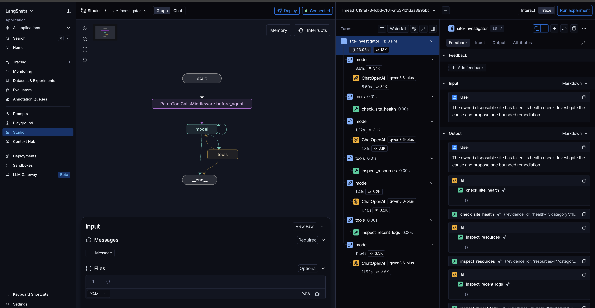

# Verification evidence

Evidence is retained as dated snapshots. Later feature verification supplements rather than replaces earlier results.

## 2026-07-19 baseline

- Scope: bounded local POC
- Python: 3.12 project virtual environment

### Reproducible checks

| Evidence | Command | Result | Scenario kind |
| --- | --- | --- | --- |
| Bootstrap, schema initialization, and offline suite | `./scripts/bootstrap.sh` | schema version 2; 114 passed | `synthetic_marker` plus container-policy simulation |
| Offline workflow, security, persistence, concurrency, and in-memory OTel export | `.venv/bin/python -m pytest -m 'not integration and not live'` | 114 passed | `synthetic_marker` plus container-policy simulation |
| Podman/Docker failure lab, remediation, and disposable OTLP collector | `RUN_CONTAINER_TESTS=1 .venv/bin/python -m pytest -m 'integration and not live'` | 13 passed | `container_fault` and `synthetic_marker` |
| Generic inference plus real service recovery | `RUN_CONTAINER_TESTS=1 RUN_LIVE_TESTS=1 .venv/bin/python -m pytest -m live` | 2 passed | live integration |

The ENOSPC and OOM failure-lab checks are genuine bounded container faults, but they remain separate from the agent workflow. CPU, memory, disk-remediation, log-storm, and the original restarting-service agent scenarios use synthetic evidence or marker files. The new service lab is a real bounded agent cycle: the owned HTTP service returns 503 and reports OCI `unhealthy`; no restart occurs before exact approval; execution restarts the same container ID; its second boot returns 200 and reports `healthy`; cleanup verifies removal.

The OpenTelemetry checks verify manual lifecycle spans, FastAPI server-span parenting, bounded metrics, exception-message suppression, normalized HTTP routes, and absence of bearer/API-key/path/private-IP/query/user-agent/host canaries from in-memory exports. The container test then sends traces and metrics to a digest-pinned, non-root, read-only disposable OpenTelemetry Collector and verifies receipt and cleanup. This is local export-path evidence, not evidence for a production backend, authentication, retention, dashboards, alerts, or sampling policy.

Persistence regression tests query SQLite directly and verify JSON-shaped credential values are absent after normalization. Model-boundary tests verify the provider body is capped before parsing and each `evidence_refs` item is independently length-limited.

### Live-inference observation

- Endpoint label: `configured-openai-compatible-chat-completions`
- Configured endpoint: `https://opencode.ai/zen/go/v1`
- Model: `deepseek-v4-flash`
- Real external model: yes
- Disk workflow: 5,558 ms, 1,019 tokens, 0 retries
- Real disposable-service workflow: 4,817 ms, 1,000 tokens, 0 retries
- Observed variability: an earlier historical run failed after three bounded attempts returned empty content; both current verification paths passed without retry.

This proves configured OpenAI-compatible assessment in both the disk flow and a real disposable-service restart flow. It does not prove provider reliability, general compatibility, deterministic model behavior, production webhook handling, real-host detection, arbitrary-container safety, or production remediation safety.

## 2026-08-10 Deep Agents extension

- Scope: hidden-fault `site-unhealthy` investigation plus full regression
- Python: 3.12 project virtual environment
- Deep Agents: 0.7.5

### Reproducible checks

| Evidence | Command | Result | Scenario kind |
| --- | --- | --- | --- |
| Targeted offline Deep Agents trajectory, policy, permissions, audit, recovery, and OTel checks | `.venv/bin/python -m pytest tests/test_site_investigation.py -m 'not integration and not live'` | 6 passed | `synthetic_marker` |
| Full offline regression | `.venv/bin/python -m pytest -m 'not integration and not live'` | 120 passed; 17 deselected | `synthetic_marker` plus container-policy simulation |
| Targeted approved Deep Agent cleanup through the hardened container executor | `RUN_CONTAINER_TESTS=1 .venv/bin/python -m pytest tests/test_site_investigation.py -m integration` | 1 passed | `synthetic_marker` with containerized execution |
| Full container regression | `RUN_CONTAINER_TESTS=1 .venv/bin/python -m pytest -m 'integration and not live'` | 14 passed; 123 deselected | `container_fault` and `synthetic_marker` |
| Targeted live Deep Agents tool-calling investigation | `RUN_LIVE_TESTS=1 .venv/bin/python -m pytest tests/test_site_investigation.py -m live` | 1 passed | live inference over `synthetic_marker` evidence |
| Full live regression | `RUN_CONTAINER_TESTS=1 RUN_LIVE_TESTS=1 .venv/bin/python -m pytest -m live` | 3 passed; 134 deselected | live integration |

The offline checks use a scripted tool-calling chat model through the real `create_deep_agent` harness. They verify bounded diagnostic tools, absence of the hidden scenario in observations, observed-evidence citation enforcement, deterministic action compatibility, no shell exposure, handoff to hash-bound approval, recovery verification, and content-free OTel attributes. This proves harness integration and deterministic trajectory behavior, not live-model reliability or real-host diagnosis.

The container-marked check runs the approved cleanup through the existing hardened container executor and verifies recovery. A native `qwen3.6-plus` probe confirmed that thinking mode also rejects forced tool choice at this endpoint; using Qwen's non-thinking request setting accepts Deep Agents' normal structured tool choice without a custom binding adapter. The state backend and permissions still deny filesystem access and expose no shell. The fixture provides one clear chain—disk pressure followed by failed rotation—so a useful investigation can stop after a small evidence set.

### Live-inference observation

- Endpoint label: `configured-openai-compatible-deep-agent`
- Configured endpoint: `https://opencode.ai/zen/go/v1`
- Model: `qwen3.6-plus`
- Real external model: yes
- Result: diagnosed `disk-exhaustion` and selected `cleanup_rotated_logs`
- Provider configuration: `enable_thinking=false`; retain Deep Agents' native tool binding
- Observed variability: Qwen thinking mode rejected required tool choice; non-thinking mode completed with `check_site_health`, `inspect_recent_logs`, and `inspect_resources` and returned the expected diagnosis.

The captured Studio view below shows the compiled Deep Agents graph and the successful live Qwen trace, including the `check_site_health`, `inspect_resources`, and `inspect_recent_logs` calls. It is presentation evidence for the verified run above, not a substitute for the reproducible tests or deterministic result validation.

This proves one successful live Deep Agents investigation against the configured endpoint and the complete existing live regression. It does not prove deterministic diagnosis, general provider compatibility, safe arbitrary shell access, production-host inspection, or autonomous remediation.
