# Full SRE Agent Roadmap

## Goal

Extend the bounded incident-response POC into a continuously improving SRE assistant without allowing the model to grant itself production authority. The system should investigate unfamiliar conditions, propose reusable operational knowledge and narrowly scoped capabilities, learn from reviewed incident outcomes, and promote changes only after explicit review and evaluation.

“Continuous learning” means improving versioned runbooks, evaluation datasets, prompts, policies, and approved capabilities. It does not mean online model-weight training or autonomous self-modification.

## Authority boundary

The agent may research, diagnose, retrieve approved knowledge, and create structured proposals. Application code remains authoritative for validation, review state, evaluation thresholds, versioning, target scope, execution, verification, rollback, and audit history.

Human review is owned by the application rather than LangSmith Studio. A reviewer may use a CLI, API, or another trusted interface. Automated tests may simulate that reviewer, but simulation must be clearly labeled and must exercise the same decision method used by a real reviewer.

The agent must never:

- add its own proposal directly to an approved registry;
- turn generated prose or shell text into executable authority;
- bypass evaluation because a reviewer approved a candidate;
- use an unapproved runbook or capability as if it were promoted;
- expand a target, parameter range, or environment beyond the approved version;
- silently learn from an unreviewed or failed incident.

## Maturity progression

### 1. Unknown-condition investigator

Start with a generic health or error signal and gather bounded, read-only evidence from approved sources such as health checks, metrics, logs, traces, deployment history, configuration history, service ownership, dependencies, and existing runbooks. The investigator should form testable hypotheses, cite observations, and abstain when evidence is insufficient.

The first POC uses a disposable synthetic target and existing typed diagnostic-tool patterns. It does not claim arbitrary production discovery.

### 2. Runbook candidate lifecycle

When no approved runbook fits, the agent may propose a structured candidate containing:

- a stable problem signature and title;
- applicability signals and required evidence categories;
- bounded diagnostic steps;
- a supported conclusion or explicit escalation condition;
- citations to evidence observed during the incident;
- confidence and stated limitations.

Candidates move through explicit states such as `pending_review`, `rejected`, `evaluation_failed`, `promoted`, and `retired`. Review decisions record an actor, timestamp, and bounded note. Approval authorizes evaluation, not promotion by itself.

### 3. Evaluation and incident-learning loop

An approved candidate is evaluated against hidden positive, negative, and distractor cases. Deterministic checks should cover citation validity, boundedness, expected matching, false-positive avoidance, and required diagnostic coverage. Promotion requires a versioned threshold; failures remain inspectable and cannot be retrieved as approved knowledge.

Reviewed incidents can later be added to LangSmith datasets and annotation queues. Offline experiments compare the current registry or prompt with a candidate version before deployment. Online evaluators may identify novel or weak runs, but they do not promote changes automatically.

### 4. Capability proposal lifecycle

A later phase may allow the agent to propose a typed executable capability. A capability candidate must define parameters, allowed targets, prerequisites, required evidence, maximum blast radius, approval policy, idempotency, timeout, verification, and rollback. Human-written or independently reviewed executor code binds the definition to an implementation.

The knowledge registry and executable capability registry remain separate. Promoting a runbook never grants a new action.

### 5. Controlled activation and feedback

Approved capabilities are activated only in a disposable or explicitly allowed environment. The first execution is constrained to one target, followed by deterministic health verification. Failure triggers bounded rollback or escalation. Outcomes become reviewed evidence for regression cases and future runbook revisions.

## Target architecture

```mermaid
flowchart LR
    Alert["Unknown incident signal"] --> Investigation["Read-only investigation"]
    Investigation --> Retrieval["Retrieve approved runbooks"]
    Retrieval --> Decision{"Applicable runbook?"}
    Decision -->|yes| Guidance["Use versioned guidance"]
    Decision -->|no| Candidate["Create runbook candidate"]
    Candidate --> Review["Application-owned human review"]
    Review -->|reject| Rejected["Retain rejected audit record"]
    Review -->|approve| Evaluation["Hidden deterministic and LangSmith evaluations"]
    Evaluation -->|fail| Failed["Retain evaluation failure"]
    Evaluation -->|pass| Registry["Promoted runbook registry"]
    Registry --> Retrieval
    Guidance --> Capability{"Approved action exists?"}
    Capability -->|no| CapabilityCandidate["Propose capability; no authority granted"]
    Capability -->|yes| ExistingControl["Immutable proposal and approval control plane"]
    CapabilityCandidate --> CapabilityReview["Independent review, implementation, and evaluation"]
    CapabilityReview --> ExistingControl
    ExistingControl --> Verify["Canary verification and rollback"]
    Verify --> Feedback["Reviewed outcome and regression case"]
    Feedback --> Evaluation
```

## First implementation slice: runbook-learning POC

The first slice deliberately stops before dynamic executable capabilities.

1. Create one unfamiliar disposable incident profile.
2. Investigate it through typed, read-only tools.
3. Produce a structured runbook candidate without hidden expected labels.
4. Persist the candidate and content digest in SQLite.
5. Exercise application-owned approve and reject decisions; tests simulate the reviewer.
6. On approval, run deterministic hidden positive and distractor cases.
7. Promote only a passing candidate as an immutable version.
8. Demonstrate that a later incident retrieves the promoted runbook.
9. Verify rejected, failed, or tampered candidates cannot be retrieved.
10. Record reproducible offline evidence and keep live inference optional.

This slice now includes a retained LangSmith before/after experiment. The first fresh investigation searches an empty approved registry; reviewed knowledge is then revised, gated, and promoted; a second fresh investigation searches and opens the immutable promoted version through read-only tools and returns its exact version and digest. Offline policy tests prove that unpromoted lifecycle states and tampered versions remain unavailable. See `docs/evidence.md` for the measured trajectory, latency, token, and evaluator comparison.

## POC non-goals

- Production Kubernetes, cloud, paging, or observability credentials.
- Arbitrary web research or host shell access.
- Autonomous executable whitelist mutation.
- Agent-generated executor code.
- Highly available or multi-tenant persistence.
- Fleet-wide canaries or production rollback orchestration.
- Statistical claims from a small synthetic dataset.
- Model-weight training or unattended prompt deployment.

## Follow-on capability POC

After the runbook loop is demonstrated, add one disposable-lab capability such as `reduce_worker_concurrency`. The agent may propose its schema and safety contract, but trusted code supplies the implementation. Promotion requires human approval, policy checks, hidden evaluation cases, one-target activation, health verification, and rollback. The existing immutable remediation proposal remains the final execution boundary.
